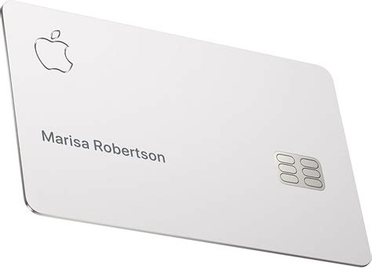

<link rel='StyleSheet' href='css/pdf.css' type='text/css'>

## Apple Card and when will it come to the UK?

This post covers what I have discovered about Apple Card (as used in the US) and when it might be launched in the UK.

Apple's credit card was made available to US citizens on 20 August 2019 and it comes in two forms: virtual and physical. Goldman Sachs is the issuing bank and Mastercard serves as the payment network. It comes with an app that works in a similar way to other apps like Monzo.

### Charges

Except for interest charges, Apple says its card has no fees (e.g. late, cash-advance, international, overdraft or annual credit card fees).

### Daily Cash (cash-back)

The card has three levels of cash-back:

1. 1% for purchases made with the physical card,
2. 2% for purchases made with Apple Pay and 
3. 3% for purchases from Apple.

Cash-back is available daily, rather than at the end of each statement period. The rewards are deposited into the user's Apple Cash account inside Apple Wallet, which can then be used to send money via iMessage, pay part or all of the card's balance, spend at retailers and 'in apps' that accept Apple Pay or be transferred to a bank account. If customers don't have an Apple Cash account, then Daily Cash continues to accumulate, but can only be applied as a credit towards their statement balance.

### Paying the balance

You can link your Apple Card to a bank account or you can use Apple Cash to pay off your balance.

### Physical Card

The physical card is made from titanium and is designed for shopping at locations where Apple Pay contactless payments are not accepted. The card has no card number, CVV security code, expiry date or signature space. The logos on the card are engraved, and the cardholder's name is printed.

#### Discolouration and cleaning

If the Apple Card comes into contact with contaminants that can cause stains, it can be cleaned by:

1. Gently wiping it with a soft, slightly damp, lint-free microfibre cloth;
- Moistening a soft, microfibre cloth with isopropyl alcohol and gently wiping the card.

Don't use window or household cleaners, compressed air, aerosol sprays, solvents, ammonia, or abrasives to clean your titanium Apple Card.

Some fabrics, like leather and denim, might cause permanent discolouration that will not wash off.

### Virtual Card

The virtual card is integrated with Apple Pay and Apple Wallet where it works like other cards that are linked to Apple Pay.

As the physical card has no number, how are payments made over the phone or on sites that don't accept Apple Pay? The answer, which is also a great security feature, is that your Apple Card can generate virtual card numbers and confirmation codes (CVVs).

These numbers and codes can be cancelled and new ones generated whenever you want. This is great for situations where you have given your details to someone or a website you don't completely trust.

Each purchase requires a confirmation code which makes it even harder for someone to use your card, even if it has been copied to make online purchases.

### Will it be launched in the UK?

There have been no announcements about when, or whether, Apple Card will be launched outside the US, but we’ve had at least one encouraging sign: Apple has filed trademarks in databases in both Europe and Hong Kong. The European filing would cover the 28 European Union members (which currently includes the UK).

Also, with hardware sales declining, Apple is intent on expanding its services (like Apple TV+) which means it would very much be in Apple‘s interests to introduce its credit card wherever it can.

It would be more attractive, but not essential, if Apple Cash was also introduced.

It has been reported that Apple Card doesn't have a PIN number. If this is true, if would be a big obstacle for using the physical card in the UK.

### When will it come to the UK?

Assuming the Apple intends to release its card in the UK, the earliest it could launch would be in the autumn of 2019. This is a very optimistic estimate because Apple Pay launched in the US in October 2014, before making its way across the Atlantic in July the following year and we've seen no sign of Apple Cash.
